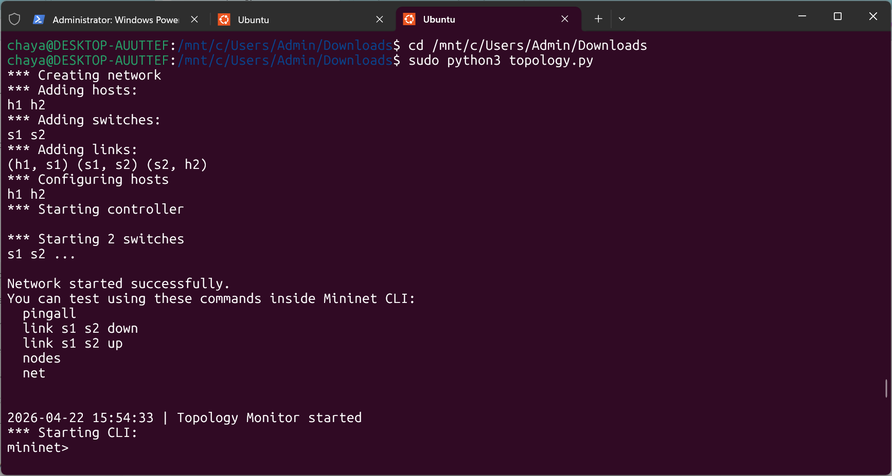
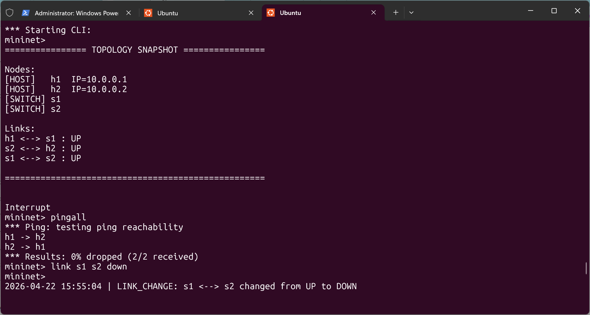
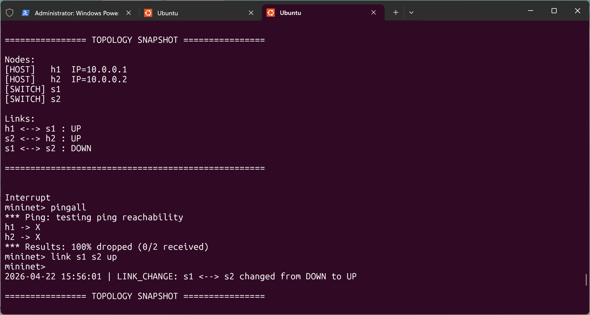
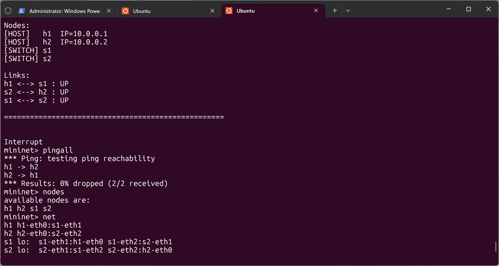

# SDN-Based Topology Change Detection using Mininet

## Overview
This project demonstrates topology change detection in a network using Mininet.  
A custom monitoring system is implemented to detect link failures and restorations in real time and analyze network behavior.

---

## Objective
- Understand network topology using Mininet  
- Detect link failures dynamically  
- Monitor network changes in real time  
- Analyze connectivity during failure and recovery  

---

## Technologies Used
- Ubuntu (WSL / Mininet Environment)  
- Mininet (Network Emulator)  
- Python  
- Open vSwitch (OVSBridge)  

---

## System Architecture
The system consists of the following components:

- Mininet: Creates a virtual network topology  
- Switches (OVSBridge): Forward packets  
- Hosts: Generate traffic  
- Monitoring Module: Detects link status changes  

---

## Implementation

### 1. Network Topology
A simple topology is created using Mininet.

This creates:
- 2 Hosts (h1, h2)
- 2 Switches (s1, s2)

---

### 2. Monitoring Logic
The system continuously checks link status:

- If link is active → UP  
- If link fails → DOWN  

Whenever a change occurs:
- Event is detected  
- Topology is updated  
- Output is displayed  

---

### 3. Running the Program

sudo python3 topology.py

---

### 4. Testing

pingall  
link s1 s2 down  
link s1 s2 up  

- Connectivity is tested using pingall  
- Link failure and recovery are simulated  

---

## Results
- Link failures are successfully detected  
- Topology updates dynamically  
- Communication fails when link is down  
- Network restores after link is up  

---

## Output Screenshots

### Program Start

### Initial Topology and Link Down

### Link Failure Detection

### Link Restoration and Final Output

---

## Key Concepts
- Network topology monitoring  
- Link state detection (UP/DOWN)  
- Dynamic topology updates  
- Connectivity validation  

---

## Future Work
- Integrate SDN controller (Ryu/POX)  
- Implement flow rules  
- Extend to larger networks  
- Add visualization  

---

## Conclusion
This project demonstrates how topology changes affect network communication.  
Using Mininet, link failures and restorations are detected and analyzed effectively.

---

## Author
Chaya S  
AIML Engineering Student
